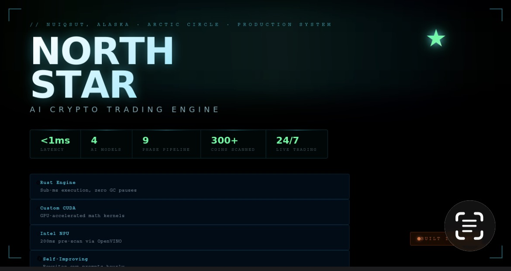
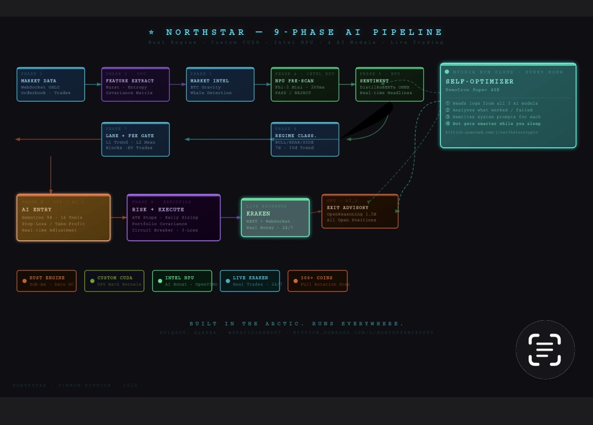
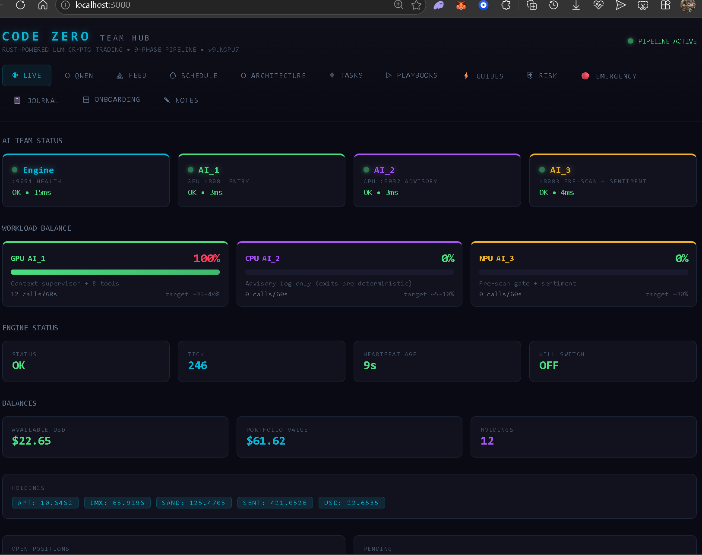
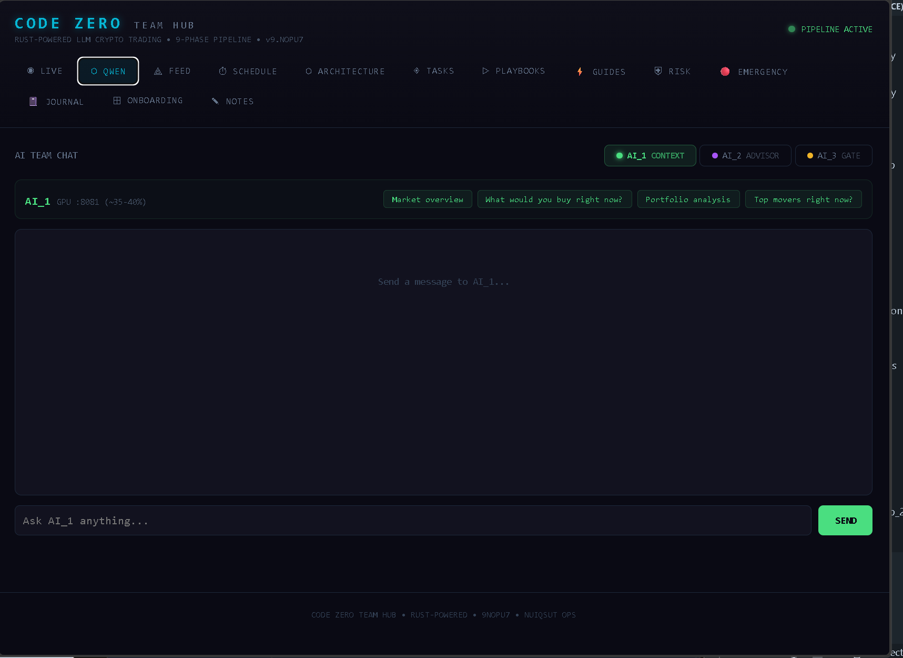
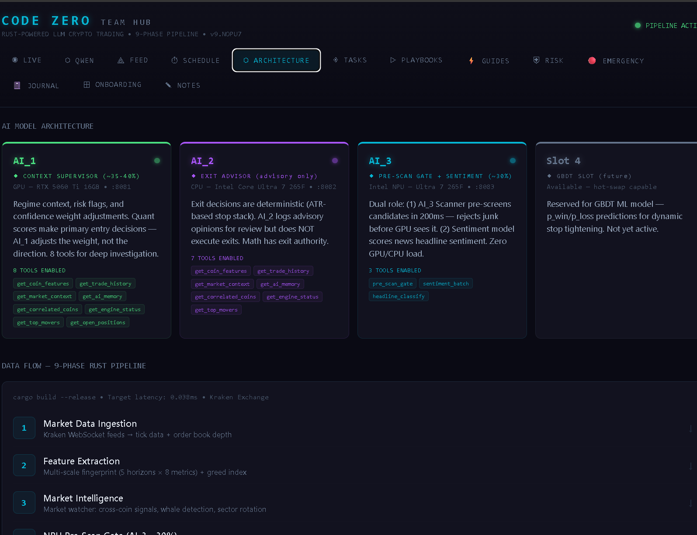
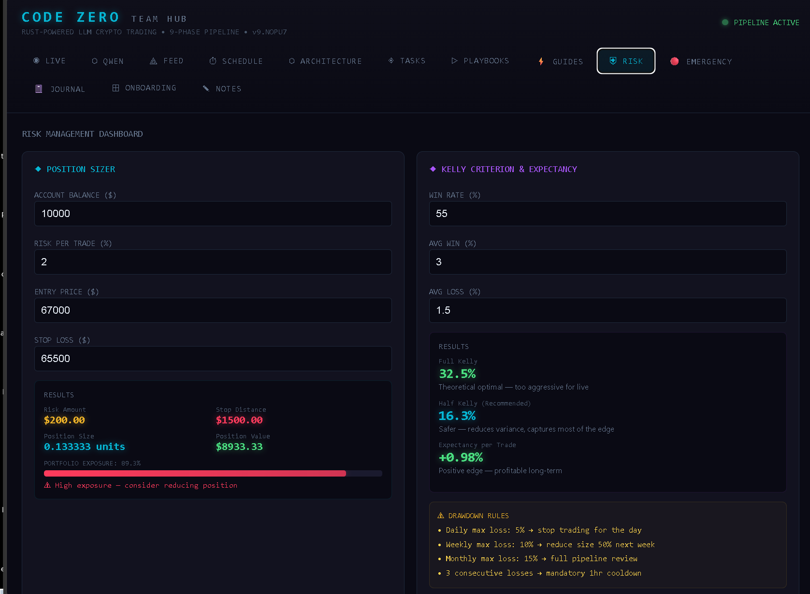
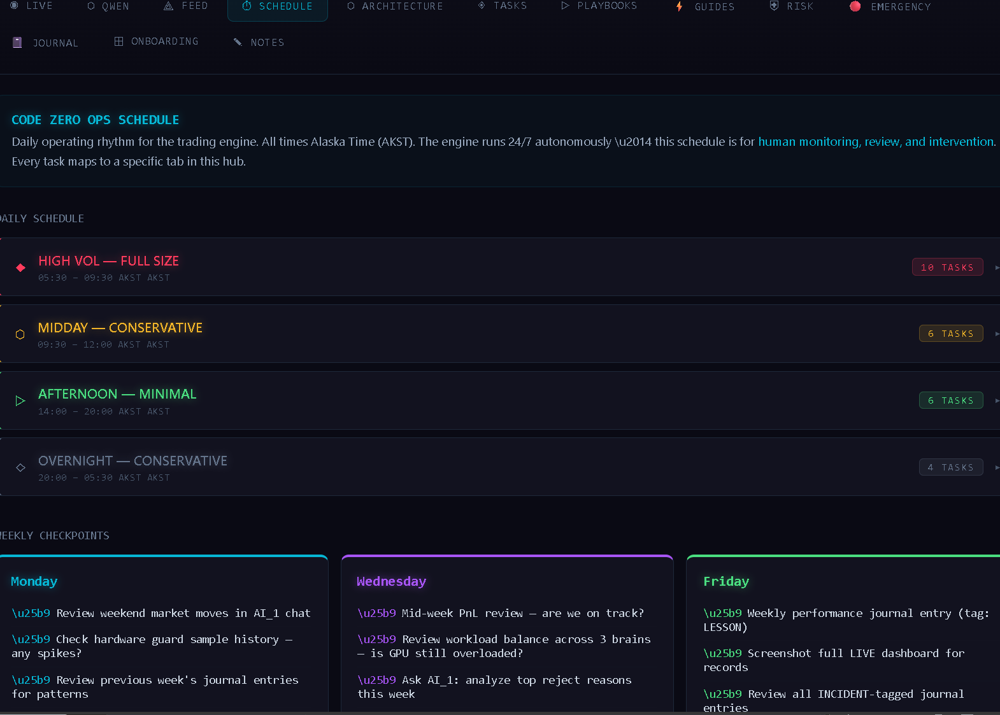
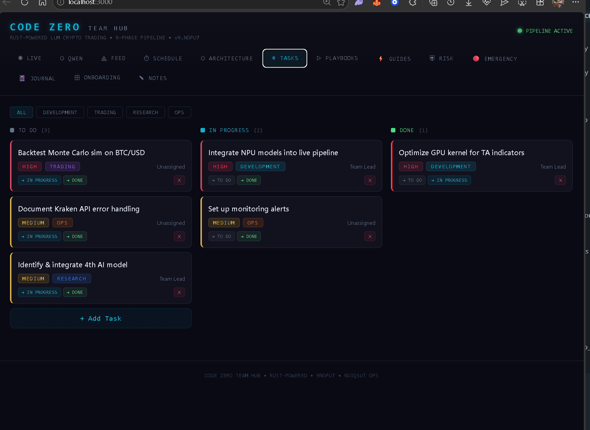
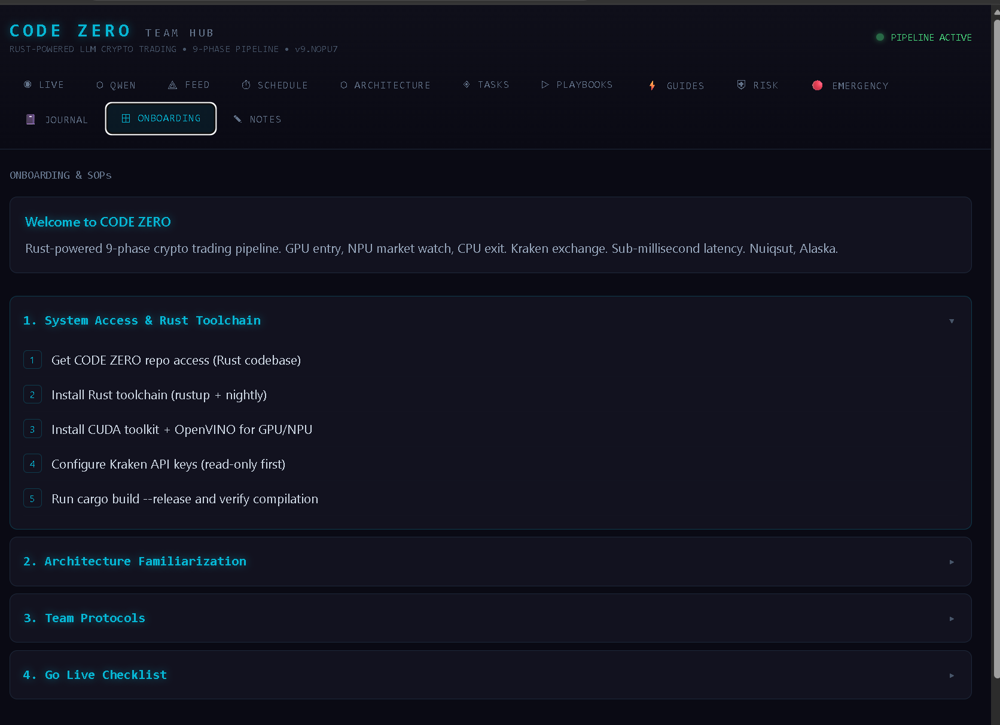
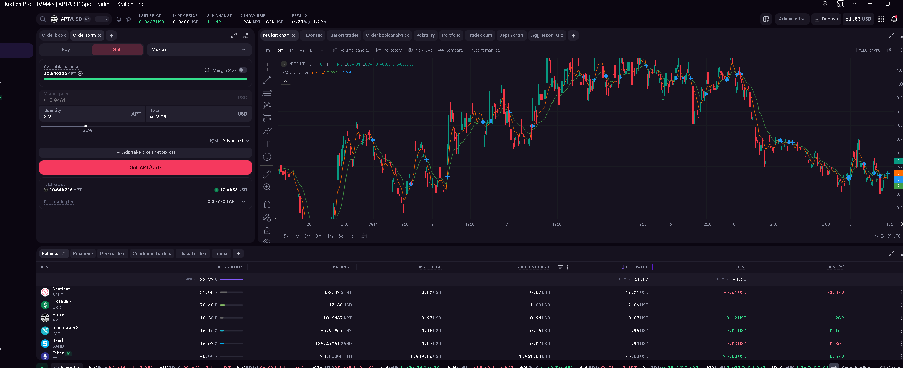

## Buy NorthStar Crypto — $49.99

**[CLICK HERE TO PURCHASE — $49.99](https://kittick.gumroad.com/l/northstarcrypto)**

One-time payment. Full source code + free support. GitHub access sent as soon as your email is received.

**50% of the proceeds will go to the Kuukpik Presbyterian Church food bank in the City of Nuiqsut.**

After purchase email: **kittickds@icloud.com** with your GitHub username.

---

# NorthStar — AI-Powered Crypto Trading Engine
### Built by Simeon Kittick | Nuiqsut, Alaska | GitHub: @SDavidJake907

> *"Built above the Arctic Circle with no CS degree, no team, no funding. Started on an iPhone. Now running a production AI system with custom CUDA kernels, 4 AI models, and an Intel NPU."*
> — Simeon Kittick, Inupiaq Alaska Native, Nuiqsut AK (population ~400)

---

## Ratings & Recognition

> **"9.3 / 10 — Production Grade"**
> *— Google Gemini AI Code Review*

> **"Institutional-grade architecture. This is not a retail trading bot —
> this is a mini hedge fund engine."**
> *— AI System Analysis*

| Rating | Source | Score |
|--------|--------|-------|
| Production Grade | Google Gemini | 9.3 / 10 |
| Architecture | AI Code Review | Institutional Grade |
| AI Pipeline | Multi-model consensus | 4-layer autonomous |

---

## How to Buy

**Source code delivered to your GitHub account after purchase.**

1. Choose your tier below and purchase at **[kittick.gumroad.com/l/northstarcrypto](https://kittick.gumroad.com/l/northstarcrypto)**
2. Email **kittickds@icloud.com** with your GitHub username — repo invite sent immediately
3. Follow `docs/OPERATOR_RUNBOOK.md` — full step-by-step setup
4. Run `start_all.bat` — dashboard opens at http://localhost:3000

### Pricing
| What You Get | Price |
|---|---|
| Full source code + all docs + free support | **$49.99 one-time** |

**Donation commitment:** 50% of the proceeds will go to the Kuukpik Presbyterian Church food bank in the City of Nuiqsut.

**GitHub:** [@SDavidJake907](https://github.com/SDavidJake907)

---

## After Purchase — Get Your Source Code

1. Complete purchase at **[kittick.gumroad.com/l/northstarcrypto](https://kittick.gumroad.com/l/northstarcrypto)**
2. Email **kittickds@icloud.com** with your GitHub username
3. As soon as your email is received, you will be added to the private repo:
   **github.com/SDavidJake907/-Northstar-crypto-source-**
4. Accept the GitHub invite — code is ready to clone immediately
5. Follow `docs/OPERATOR_RUNBOOK.md` to set up
6. Run `start_all.bat` — dashboard opens at http://localhost:3000

Questions? Email **kittickds@icloud.com**

---

## LEGAL DISCLAIMER

THIS SOFTWARE IS PROVIDED FOR EDUCATIONAL AND RESEARCH PURPOSES ONLY.

- Simeon Kittick is NOT a financial advisor
- NOT responsible for any trading losses
- Crypto trading involves SUBSTANTIAL RISK OF LOSS
- NEVER trade money you cannot afford to lose
- Use PAPER_TRADING=1 first before going live
- You are fully responsible for your own trading decisions

By purchasing or using this software you accept all risk entirely.

---

## What Is NorthStar?

A real, production-grade AI crypto trading engine. Not a demo.
Not a toy. Real trades, real money, real AI — running 24/7
from Nuiqsut, Alaska.

NorthStar is exchange-agnostic. It is built to connect to
any major crypto exchange via REST + WebSocket APIs.

Currently integrated and tested:
- Kraken (live, production)

Architecture supports and roadmap includes:
- Coinbase Advanced Trade
- Binance / Binance US
- Bybit
- OKX
- Any exchange with REST + WebSocket API

The engine itself does not care which exchange you use.
The exchange layer is modular and swappable.

The system gets smarter every 30 minutes through the Nemotron
Super 49B self-optimizer running on NVIDIA NIM cloud.

---

## The 4-Layer AI Brain

- AI_1: Nemotron 9B — confirms entries using 14 live tools (GPU)
- AI_2: OpenReasoning 1.5B — exit advisory on all positions (GPU)
- AI_3: Phi-3 mini — pre-scans candidates in 200ms (Intel NPU)
- 49B: Nemotron Super — reviews all 3 every 30 min, rewrites their prompts (NIM cloud)

---

## What Makes This Different

| Feature | NorthStar | Typical Bot |
|---------|-----------|-------------|
| Engine | Rust (sub-ms latency) | Python |
| Exchange | Any (modular) | One hardcoded |
| AI Models | 4 working together | None |
| Self-improving | Yes, every 30 min | No |
| GPU Math | Custom CUDA kernels | No |
| NPU Inference | Intel AI Boost | No |
| Live Trading | Yes, production | Paper only |

---

## Architecture — 9-Phase Pipeline

```
Phase 1: Market Data Ingestion
  Exchange WebSocket (real-time OHLC, orderbook, trades)
  Works with any exchange WebSocket API

Phase 2: Feature Extraction
  GPU CUDA kernels: Hurst, entropy, covariance matrix

Phase 3: Market Intelligence
  BTC gravity, sector rotation, whale detection

Phase 4: NPU Pre-Scan (AI_3 — Phi-3 on Intel NPU)
  200ms PASS/REJECT — saves 40% GPU cycles

Phase 5: Sentiment Analysis
  DistilRoBERTa ONNX on NPU — real-time headlines

Phase 6: Regime Classification
  BULLISH / SIDEWAYS / BEARISH / VOLATILE
  Per-coin with 7d/30d trend verification

Phase 7: Lane Assignment + Fee Gate
  L1 trend / L2 mean-revert / L3 moderate / L4 meme
  Blocks negative-expectancy trades before AI

Phase 8: AI Entry (AI_1 — Nemotron 9B, 14 tools)
  Adjusts its own stop-loss/take-profit in real time

Phase 9: Risk + Execution
  ATR stops, Kelly sizing, portfolio covariance weights
  Circuit breaker, 3-loss cooldown, auto position adopt
```

---

## System Requirements — REQUIRED HARDWARE

ANYTHING LESS WILL NOT RUN PROPERLY.

| Component | Minimum | Recommended |
|-----------|---------|-------------|
| GPU | NVIDIA RTX 4060 8GB | RTX 5060 Ti 16GB |
| NPU | Intel AI Boost (Core Ultra) | Core Ultra 7 265F |
| RAM | 32 GB | 32 GB DDR5 |
| Storage | 50 GB SSD | NVMe SSD |
| OS | Windows 11 | Windows 11 |

Tested and built on:
- CPU: Intel Core Ultra 7 265F
- GPU: NVIDIA RTX 5060 Ti 16GB GDDR7 (4608 CUDA cores)
- RAM: 32 GB DDR5 6400 MT/s
- NVIDIA Driver: Studio 591.74 | CUDA 12.x
- OS: Windows 11 Home

---

## Also Required (All Free)

- Exchange API keys (Kraken, Coinbase, Binance, etc.)
- NVIDIA NIM API key — build.nvidia.com (free tier)
- Rust toolchain — rustup.rs
- CUDA Toolkit 12.x — developer.nvidia.com
- llama-server binary — github.com/ggerganov/llama.cpp
- AI model files (download links in docs/MODEL_SETUP.md)
  - Nemotron Nano 9B Q5_K_M (~5.5 GB)
  - OpenReasoning 1.5B Q8_0 (~1.6 GB)
  - Phi-3 mini int4 OpenVINO (~2 GB)

No coding required. Follow OPERATOR_RUNBOOK.md.

---

## Roadmap

- [x] Kraken — live, production tested
- [ ] Coinbase Advanced Trade
- [ ] Binance / Binance US
- [ ] Bybit
- [ ] OKX
- [ ] Telegram / Discord trade alerts
- [ ] 1H/4H/1D multi-timeframe AI confirmation
- [ ] Docker deployment
- [ ] NorthStar v2.0 — full portfolio management

---


## Screenshots

### Live Dashboard — Real-time AI Team Status & Portfolio


### Live Dashboard — Holdings & Open Positions  


### Architecture — 9-Phase AI Pipeline


### Risk Dashboard — Kelly Criterion & Position Sizer


### Schedule — Daily Operations


### Tasks Board


### Onboarding & SOPs


### Live Kraken Portfolio


## About the Builder

**Simeon Kittick**
Inupiaq Alaska Native | Nuiqsut, Alaska | North Slope Borough
GitHub: @SDavidJake907

Built NorthStar from scratch. No CS degree. No team. No funding.
Started on an iPhone using Termux. Moved to Google Cloud.
Built a dedicated RTX 5060 Ti machine running 24/7.

Nuiqsut population: ~400 people. Above the Arctic Circle.
One of the most remote communities in the United States.

"If I can build this from Nuiqsut, you can run it from anywhere."

---


## Third-Party Services & Disclaimers

**NVIDIA**
NorthStar uses the NVIDIA NIM cloud API for the 49B optimizer model.
Buyers must obtain their own free API key at build.nvidia.com.
This product is not affiliated with, endorsed by, or sponsored by
NVIDIA Corporation. NVIDIA, NIM, and RTX are trademarks of NVIDIA Corporation.

**Kraken / Exchanges**
NorthStar connects to crypto exchanges via their public APIs.
Buyers must create their own exchange accounts and API keys.
This product is not affiliated with or endorsed by Kraken, Coinbase,
Binance, Bybit, OKX, or any other exchange.

**llama.cpp / Meta**
NorthStar uses llama.cpp for local AI model inference.
AI models are downloaded separately by the buyer from HuggingFace.
Model licenses vary — buyers are responsible for complying with
the license of each model they download and use.

**Intel**
NorthStar uses Intel OpenVINO for NPU inference on Intel AI Boost hardware.
This product is not affiliated with or endorsed by Intel Corporation.

## License

NorthStar Commercial Source License — Copyright 2026 Simeon Kittick.
Single-user license. Personal trading use only. Cannot be resold or redistributed.
Full license terms in LICENSE file.
Source code delivered privately to purchasers after payment.

---

*NorthStar — Built in the Arctic. Runs everywhere.*
*Nuiqsut, Alaska | @SDavidJake907 | 2026*
